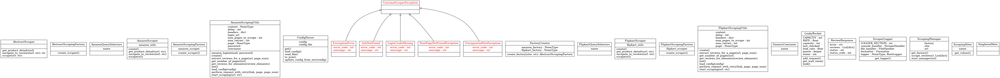
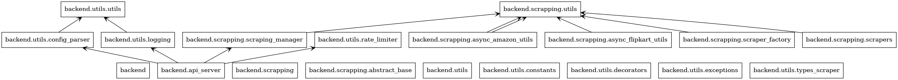

## Technology choices:

### Frontend: 

_streamlit_ - Streaml
it is one of the framework  that a python programmer can use it with basic understanding how UI works.

### Backend:

Since this assignment contains multiple third-party API calls, the suitable choice will be to go with async programming
and use the co-routines to unblock and wait for the result, given that used the FastAPI as a backend

### Deployment
I have used docker-compose to deploy both frontend and backend, I'm using docker-compose here as number of service 
components are not many. Also, it can allow specifying dependency.

### What I have included
1. A bash script to build and run the frontend and backend
2. docker-compose.yaml which will build and start conainers
3. backend code 
4. frontend code

## API Documentation: URL Input Handler (GET)

### Overview

This API allows you to submit a URL as an input and get a response based on the content or processing associated with that URL.

### Endpoint
GET /api/scrape_reviews
### Query Parameters

The API accepts a URL as a query parameter.

| Parameter  | Type   | Description                                                     | Required |
|------------|--------|-----------------------------------------------------------------|----------|
| `url`      | string | The input URL is **limited to product reviews page** of the product | Yes      |

### Example Request
GET /api/scrape_reviews?url=https://www.amazon.in/OnePlus-28-85cm-11-35-inch-2-4K/product-reviews/B0CJ94J5CX/ref=cm_cr_dp_d_show_all_btm?ie=UTF8&reviewerType=all_reviews


### Response

The response depends on the implementation but typically will contain a status or result based on processing the provided URL.

#### Success Response (HTTP 200)
If the URL is valid and successfully processed, the response will contain the scraped reviews, status, status_code and error
parameter set to '' as shown in below response json
- **Code** 200 
- **Content**
```json
{
  "reviews": [
    {
      "review_title": "4.0 out of 5 stars Pencil support nh hai",
      "review_body": "Everything is good but tablet doesn't support pencil..Display is goodSound is good",
      "review_date": "Reviewed in India on 3 February 2025",
      "rating": "4.0"
    },
    {
      "review_title": "4.0 out of 5 stars Processor is below average but for the price it's okay",
      "review_body": "Display really good.90hz but most of app only support 60hz.Charging speed is averageIt lags.That's all but for the price it's okay 👍 👌",
      "review_date": "Reviewed in India on 22 January 2025",
      "rating": "4.0"
    }
  ],
  "status": "success",
  "status_code": 200,
  "error": ""
}
```
#### Failure Response (HTTP 500)
In case of failure 
- **Code** - 400, 429, 500
- **Content**
```json
{
  "reviews": [],
  "status": "failed",
  "status_code": 500,
  "error": "Failed to scrape the reviews due to internal error"
}
```

## Diagrams
### Backend Class Diagram
Following class diagram shows the base classes and abstract classes for the backend


### Package structure 
Following diagram shows the package relation for the backend


## Features 
### Frontend 
1. Frontend can show an input box to paste an Amazon or Flipkart products reviews page
and a button to start scraping and it will show the paginated reviews showing title, body, rating and date 
2. During deployment of frontend you can set following parameters
```shell
BACKEND_URL=http://<URL>:<PORT>
REVIEWS_PER_PAGE=5 # an integer value
```
### Backend
1. Backend uses FastAPI and co-routines to parallelise the scraping parallelism is at two places 
- at the page level and 
- at the review level 
2. You can configure how many number of pages that you want to scrape, you configure for both independently
```shell
AMAZON__MAX_PAGES_TO_SCRAPE=10
FLIPKART__MAX_PAGES_TO_SCRAPE=15
```
3. It uses rate limiter to avoid overburdening the API, rate limiter parameters can be configured using the config 
```shell
RATE_LIMITER__LEAK_RATE=1.0
RATE_LIMITER__CAPACITY=20
```
4. It uses configurable retry and delay to try scraping the page, can be explicitly configured for each site 
```shell

```
5. Since, Amazon requires login to account to scrape the product reviews, code also fetches credentials from config 
which can also be overwritten using environment variables
```shell
AMAZON__USERNAME=<email>
AMAZON__PASSWORD=<encrypted_password> # use from utils import encrypt_data which by default will use passphrase 
# from code by default 
```
### Limitations
1. Navigation from root page to reviews page is considered not in scope
2. Not implemented scraping product details and date conversions
